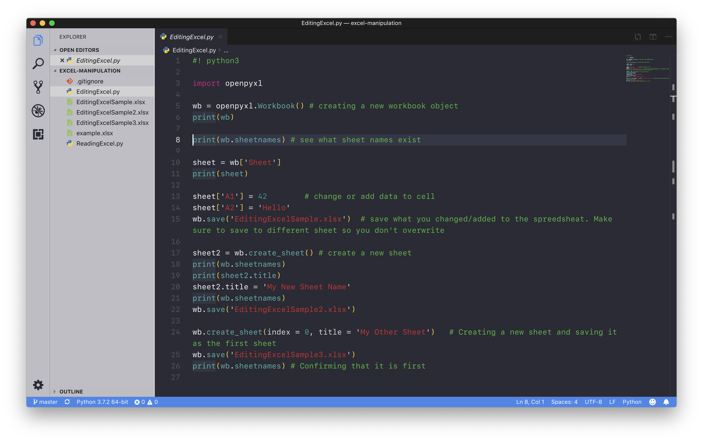
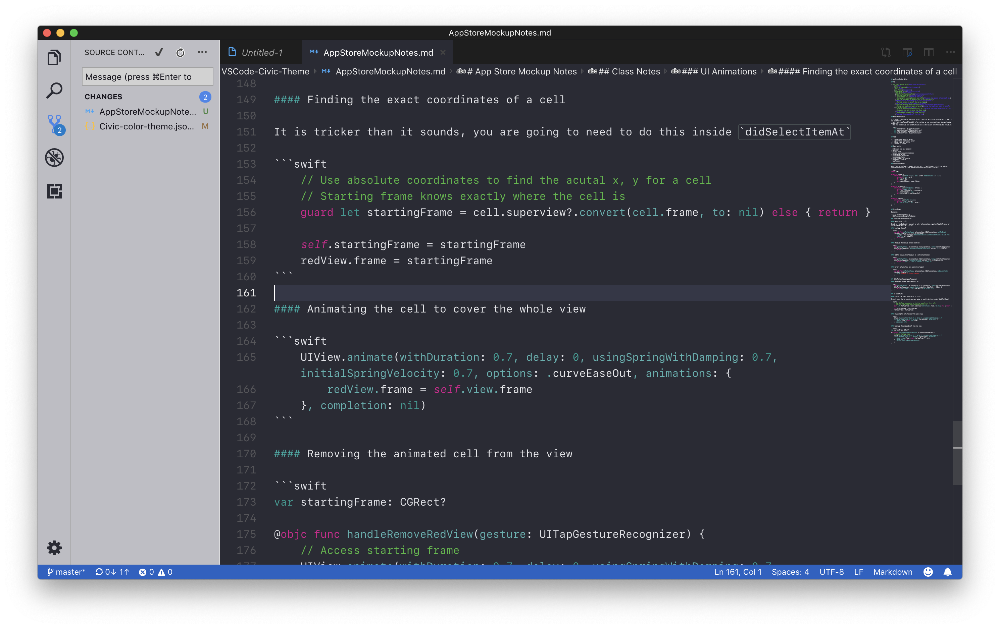

# Civic Theme

XCode inspired Civic theme for VSCode. I try to mimic this app similar to the XCode IDE. A dark version of this theme will be in future updates.

## Screenshots

### Python

### JavaScript

### SCSS

### Markdown

## Other

- The font used for these screenshots was Apple's SF Mono.

- The reason why this theme is set as a light theme is because a lot of uneditable buttons were blending in with the white background, this is the best I could think of while maintaining a white XCode feel.

## TODO

- [ ] Finish Markdown
- [ ] Stylize Flutter
- [ ] Stylize Swift
- [ ] Modify TypeScript
- [ ] HTML Image
- [ ] Add Civic Dark theme